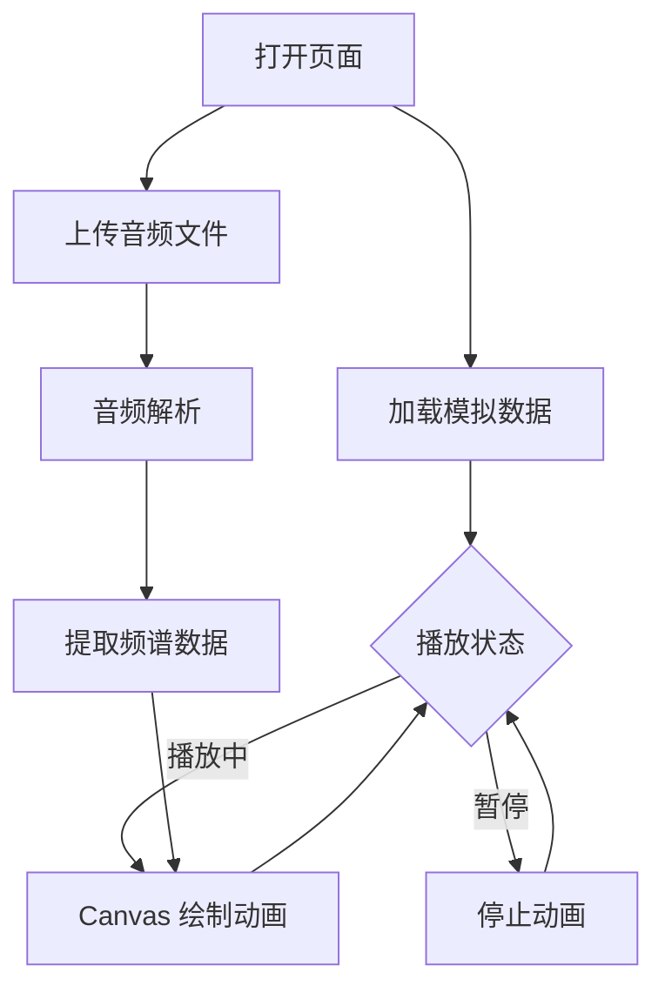

## 1. Product Overview
实时音频频谱可视化器，提供沉浸式音频视觉体验。支持模拟数据演示和真实音频文件分析，通过 Canvas 绑定绘制动态频谱柱条和环形波形。
- 核心功能：频谱可视化、音频上传分析、播放控制
- 目标用户：音频爱好者、音乐制作人、开发者演示

## 2. Core Features

### 2.1 Feature Module
1. **频谱可视化页面**：60+ 彩虹渐变频谱柱条、中央环形波形、播放控制

### 2.2 Page Details
| Page Name | Module Name | Feature description |
|-----------|-------------|---------------------|
| Spectrum Visualizer | 频谱柱条 | 60+ 柱条，彩虹渐变色，平滑过渡动画 |
| Spectrum Visualizer | 环形波形 | 中央圆形波形显示，动态旋转效果 |
| Spectrum Visualizer | 播放控制 | Play/Pause 按钮，状态切换 |
| Spectrum Visualizer | 数据来源 | 模拟数据（Math.sin + 随机噪声）、音频上传分析 |

## 3. Core Process
用户打开页面 → 默认显示模拟数据动画 → 可上传音频文件 → 自动解析音频频谱 → 实时更新可视化效果 → 播放/暂停控制

## 4. User Interface Design

### 4.1 Design Style
- 深色主题：深色背景（#0a0a0f），高对比度元素
- 按钮风格：圆形渐变按钮，hover 发光效果
- 字体：无衬线字体，现代简洁
- 布局：全屏 Canvas 居中，控制按钮悬浮在底部

### 4.2 Page Design Overview
| Page Name | Module Name | UI Elements |
|-----------|-------------|-------------|
| Spectrum Visualizer | 频谱柱条 | Canvas 绘制，彩虹渐变，平滑过渡 |
| Spectrum Visualizer | 环形波形 | 中央圆形，动态旋转，振幅可视化 |
| Spectrum Visualizer | 控制按钮 | 底部居中，Play/Pause 切换 |
| Spectrum Visualizer | 文件上传 | 顶部区域，拖拽/点击上传 |

### 4.3 Responsiveness
- 响应式布局，自适应不同屏幕尺寸
- Canvas 尺寸动态调整
- 移动端触控优化

### 4.4 色彩规范
- 背景色：#0a0a0f
- 频谱渐变：红 → 橙 → 黄 → 绿 → 青 → 蓝 → 紫
- 环形波形：白色半透明
- 控制按钮：渐变蓝紫色
