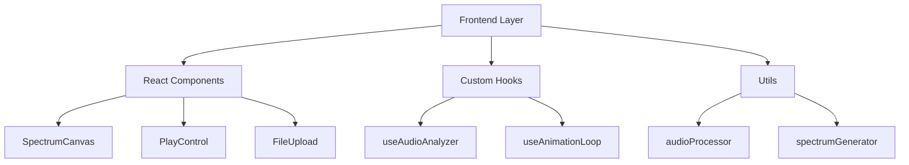
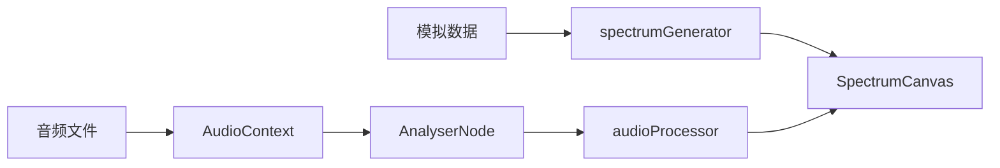

## 1. Architecture Design



## 2. Technology Description
- Frontend: React@18 + TypeScript + tailwindcss@3 + vite
- Initialization Tool: vite-init
- Backend: None (纯前端实现)
- Audio Processing: Web Audio API (AudioContext, AnalyserNode)

## 3. Route Definitions
| Route | Purpose |
|-------|---------|
| / | 频谱可视化主页面 |

## 4. API Definitions
无需后端 API，使用 Web Audio API 处理音频数据

## 5. Data Flow


## 6. Component Structure
```
src/
├── components/
│   ├── SpectrumCanvas.tsx    # Canvas 绘制组件
│   ├── PlayControl.tsx       # 播放控制按钮
│   └── FileUpload.tsx        # 文件上传组件
├── hooks/
│   ├── useAudioAnalyzer.ts   # 音频分析 Hook
│   └── useAnimationLoop.ts   # 动画循环 Hook
├── utils/
│   ├── audioProcessor.ts     # 音频处理工具
│   └── spectrumGenerator.ts  # 模拟数据生成器
├── pages/
│   └── SpectrumPage.tsx      # 主页面
├── App.tsx
└── main.tsx
```

## 7. Key Implementation Details

### 7.1 Canvas 绘制
- 使用 requestAnimationFrame 实现流畅动画
- 频谱柱条：60+ 条，彩虹渐变色，平滑高度过渡
- 环形波形：基于音频振幅的圆形可视化，动态旋转

### 7.2 音频处理
- Web Audio API 解析音频文件
- AnalyserNode 获取频率数据
- 采样率：2048 点 FFT

### 7.3 模拟数据
- Math.sin 生成基础波形
- 随机噪声模拟真实音频波动
- 平滑插值避免突变
